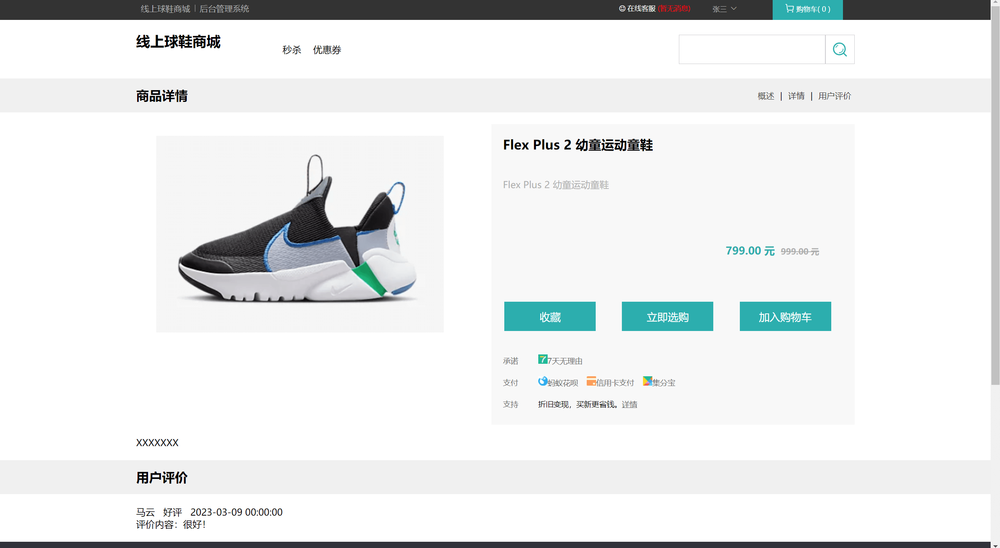
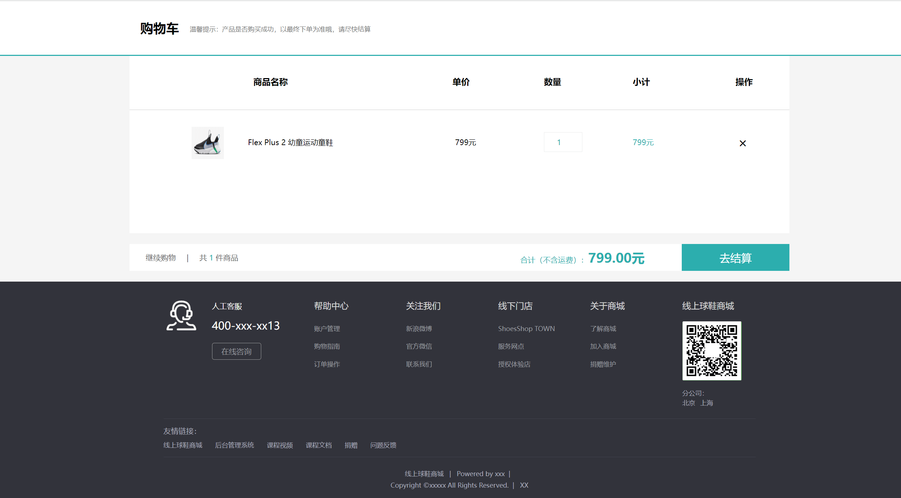
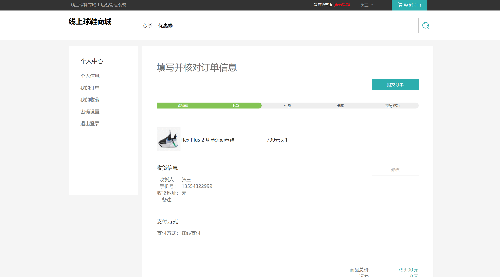
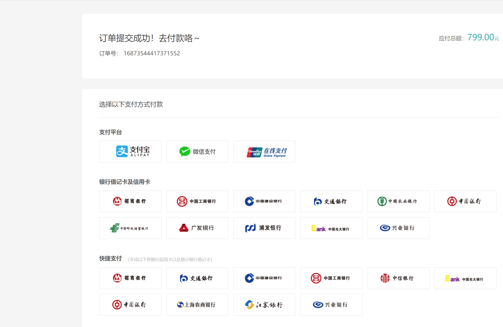
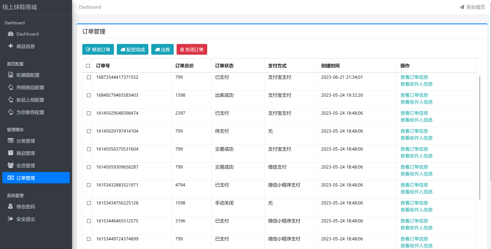
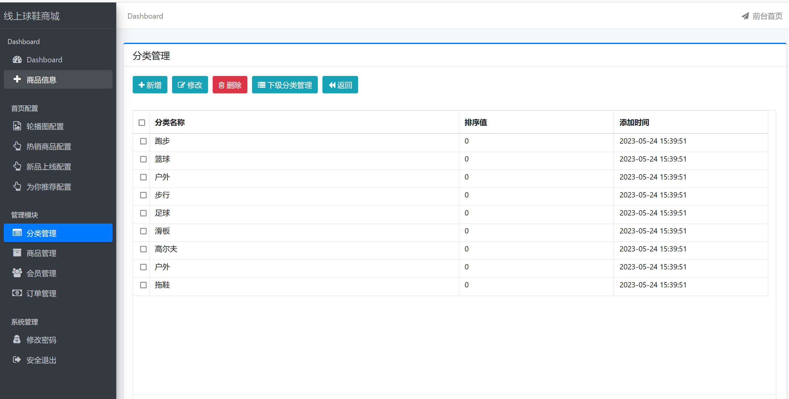
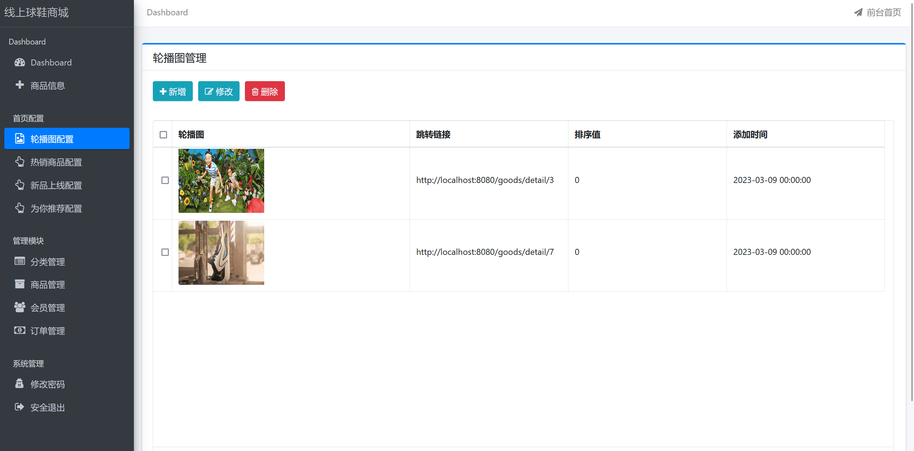
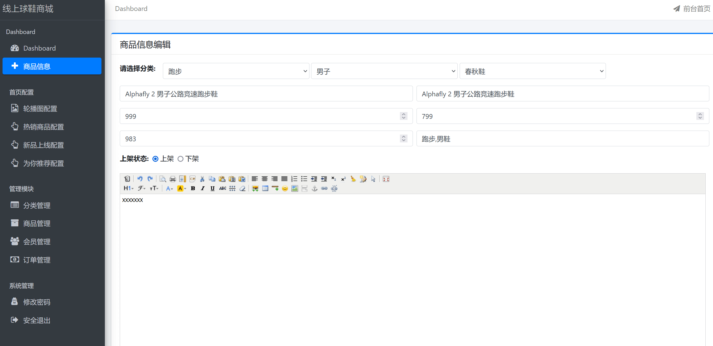
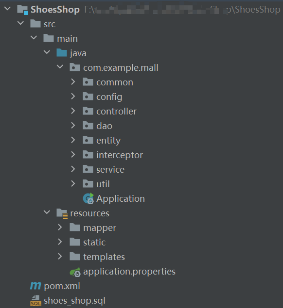

SpringBoot的鞋类商城商城, SpringBoot商城, SSM商城, 鞋类商城
## 一、功能介绍
- 包含用户和商家两个角色

#### 用户功能：

- 登录、注册、激活账号
- 修改个人信息、修改登录密码、修改支付密码
- 查看商品信息、收藏商品、加入购物车、立即购买
- 查看订单、下单、取消订单、确认收货
- 商品评价客服
- 私信功能

#### 商家功能：
- 设置联播图，设置推荐商品、设置为你推荐、设置最新商品
- 商品分类管理
- 商品信息管理
- 订单管理
- 用户管理
- 私信功能等

## 二、技术组成
- SpringBoot
- MyBatis
- Thymeleaf
- MySQL

## 三、项目截图

## 四、联系方式
需要完整代码联系博主，微信847064370

